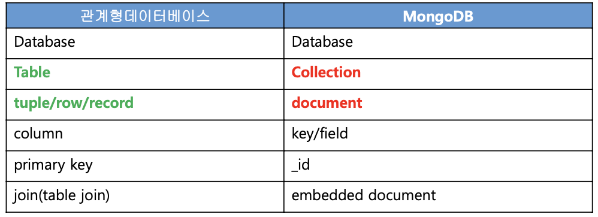
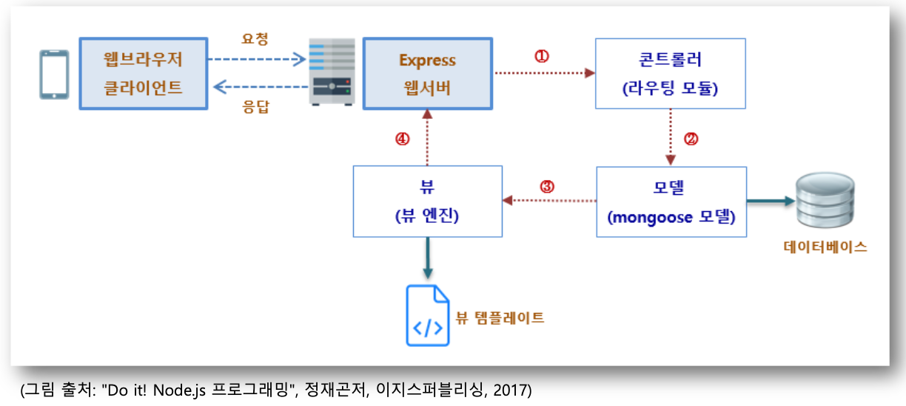
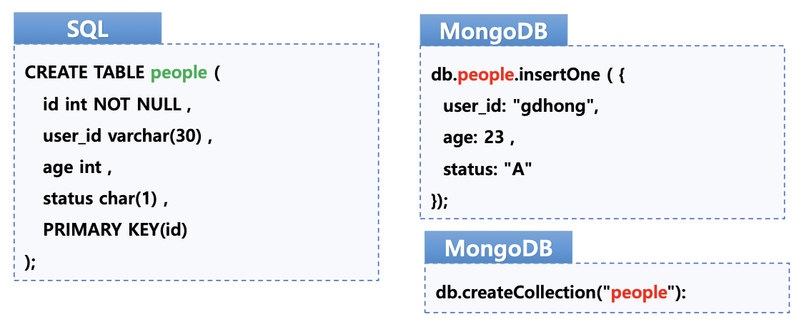
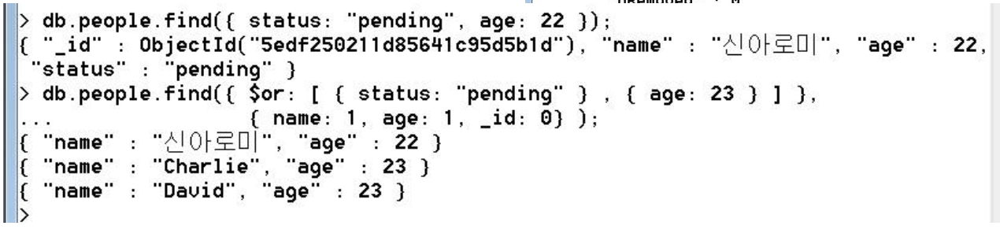
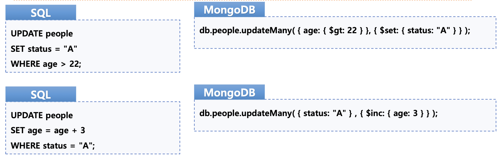

## ⚪️ MongoDB

### 개념 및 특징

- NoSQL을 사용하는 비관계형 데이터베이스
- NoSQL
    
    Not only SQL
    
    고정된 스키마가 없음 (스키마리스)
    
- 스키마리스 → 고정된 스키마 없다.  관계형 데이터베이스의 SQL을 사용하지 않는다.
- 테이블 개념이 없다. 대신 컬렉션(Collection)에 저장한다.

### DB 관련 명령

show dbs → 전체 데이터베이스 목록 조회

use testdb → 데이터베이스 선택

show collections → 데이터베이스 콜렉션 목록 조회

db.stats() →데이터베이스 상태 확인

db → 현재 데이터베이스 목록

db.dropDatabase() → 데이터베이스 삭제

### 구조

- document
    - JSON 기반의 documet 기반 데이터 관리
    - 데이터 형식 (int, float, string)
- Database → Collection(Table 대응) → Document(Row 대응)
    - Collection에 JSON형태의 Document를 입력한다.
    - Document하나가 하나의 Row(레코드)
- MongoDB Database: collection의 집합.
- MongoDB Collection: Document의 집합.



## ⚪️ 뷰 템플릿 엔진

### 뷰 템플릿

응답 웹 문서의 기본 형태를 뷰 템플릿 파일에 만들어두고 사용한다.



- 랜더링이란
    
    express 모듈이 외부 파일의 데이터를 읽어서 html 코드로 만들고 클라이언트에게 전달하는 기능을 제공하는 것
    
    ```
    // ./01ejs-ex/app.js
    const express = require("express");
    let app = express();
    const ejs = require("ejs"); // ejs 모듈을 사용하기 위해 모듈 객체 생성
    
    // ejs 템플릿
    app.set("views", __dirname + '/views'); // html 파일을 만들어 놓을 폴더 지정
    app.set("view engine", "ejs"); // 랜더링에 사용할 모듈을 지정
    
    const router = require('./routes/controller')(app);
    
    const server = app.listen(3000, () => {
        console.log('Server on 3000 port');
    });
    ```
    
    ```jsx
    // ./routes/controller-01.js
    module.exports = function(app) {
        app.get('/', (req, res) => {
            var html = "<!DOCTYPE HTML>"
                + "<html>"
                + "<head>"
                + "<meta charset='UTF-8'>"
                + "<title>"
                + "</title>"
                + "<body>"
                + "<h1>ROOT</h1>"
                + "</body>"
                + "</head>"
                + "</html>"
            res.send(html);
        });
    
        app.get('/contact', (req, res) => {
            res.send('Contact Us');
        });
    };
    ```
    
    ```jsx
    // ./03ejs-ex-layout/app.js
    const express = require('express');
    const app = express();
    
    // ejs 템플릿
    app.set('port', process.env.PORT || 3000);
    app.set('views', __dirname + '/views')
    app.set('view engine', 'ejs');
    
    /* GET home page. */
    app.get('/', (req, res, next) => {
        res.render('index02', { menu: "Home" });
    });
    
    app.get('/menu1', (req, res, next) => {
        res.render('index02', { menu: "Menu1" });
    });
    
    app.get('/menu2', (req, res, next) =>{
        res.render('index02', { menu: "Menu2" });
    });
    
    app.get('/menu3', (req, res, next) => {
        res.render('index02', { menu: "Menu3" });
    });
    
    app.listen(app.get('port'), () => {
        console.log(app.get('port'), '번 포트에서 서버 실행 중 ..')
    });
    ```
    
    ## ⚪️ MongoDB CRUD
    
    ### CRUD
    
    C (Create, Intsert)
    
    : save(), create(), insert(), insertOne(), insertMany()
    
    R (Read, Select)
    
    : find(), findById()
    
    U (Update)
    
    : updateOne, updateMany()
    
    D (Delete)
    
    : remove(), deleteOne(), deleteMany()
    
    - 입력
        
        insertMany(docs, options, callback)
        
        insertOne(docs, options, callback)
        
        
        
        ```bash
        // ./03mongodb-movie/insert.js
        const MongoClient = require('mongodb').MongoClient
        // const url = 'mongodb://localhost:27017/Moviest';
        const url = 'mongodb://127.0.0.1:27017/Moviest';
        const dbName = "Moviest";
        let db;
        
        MongoClient.connect(url, {useUnifiedTopology:true}, 
           (err, client) => {
              if (err) {
                 console.error('MongoDB 연결 실패', err);
                 return;
              }   
              db = client.db(dbName);
              // 콜렉션
              const movies = db.collection('movies');
        
           // 도큐먼트 하나 추가  
           movies.insertOne({ title: '인터스텔라', director: '크리스토퍼 놀란', year: 2014 },
              (err, result) => {
                 if (err) {
                    console.error('Insert Error', err);
                    return;
                 }
                 console.log('INSERT 성공');
                 // console.log(result);
                 console.log('새로 추가한 항목의 ObjectID : ',result.insertedIds[0]);
              }
           );
           
           // 다수의 도큐먼트 추가
           movies.insertMany([
              { title:'스타워즈', director:'조지 루카스', year:1977},
              { title:'아바타', director:'제임스 카메론'}],
              (err, results) => {
                 if (err) {
                    console.error('Insert Error', err);
                    return;
                 }
                 console.log('INSERT Many 성공');
                 console.log('새로 추가한 항목들 ObjectID : ', results.insertedIds);      
           });
           
           // Promise Based  
           movies.insertOne({ title:'스타워즈7', director:'JJ 에이브럼스', year:2015})
              .then( (results) => {
              // console.log('== Resolved\n', results);
              console.log('Promise Based Insert Result : ', results);
           }, (err) => {
              console.log('== Rejected\n', err);      
           });
        });
        
        ```
        
    - 조회
        
        find(query)
        
        findOne(query, options, callback)
        
        
        
        ```bash
        // ./03mongodb-movie/find.js
        const MongoClient = require('mongodb').MongoClient
        // const url = 'mongodb://localhost:27017/Moviest';
        const url = 'mongodb://127.0.0.1:27017/Moviest';
        const dbName = "Moviest";
        const ObjectID = require('mongodb').ObjectID;
        let db;
        
        MongoClient.connect(url, {useUnifiedTopology:true}, 
           (err, client) => {
              if (err) {
                 console.error('MongoDB 연결 실패', err);
                 return;
              }
              db = client.db(dbName);
              // const movies = db.collection('movies');
           // 다수의 도큐먼트 추가
           const promise = db.collection('movies').insertMany([
              { title: '스타워즈', director: '조지 루카스', year: 1977 },
              { title: '아바타', director: '제임스 카메론' },
              { title: '인터스텔라', director: '크리스토퍼 놀란', year: 2014 },
              { title: '스타워즈7', director: 'JJ 에이브럼스', year: 2015 }]);
           promise.then( (results) => {
              console.log('초기 데이터 입력 성공');
              executeFindExample();
           }, (err) => {
              console.error('Error : ', err);      
           });
        });
        
        function executeFindExample() {
           // 콜렉션
           const movies = db.collection('movies');
           
           // 전체 목록
           movies.find().toArray( (err, docs) => {
              console.log('== Find ALL, toArray');
              console.log(docs);
           });
           
           // projection
           const projection = { _id: 0, title: 1 };
           movies.find({}, projection).toArray( (err, docs) => {
              console.log('== Find ALL with Projection');
              console.log(docs);
           });
        
           // Query
           movies.find({ title: '인터스텔라' }).toArray( (err, docs) => {
              console.log('== Find 인터스텔라');
              console.log(docs);
           });
              
           // Query : db.movies.find({year:{$gt:2000} })
           movies.find({ year: { $gt: 2000 } }).toArray(  (err, docs) => {
              console.log('== 2000년 이후의 영화');
              console.log(docs);
           });
           
           // Query : db.movies.find({ $or:[ { year: {$gt:2000} },{ director:"크리스토퍼 놀란" } ] } )
           movies.find({ $or: [{ year: { $gt: 2000 } }, { director: "크리스토퍼 놀란" }] })
            .toArray( (err, docs) => {
              console.log('== OR Query');
              console.log(docs);
           });
           
           // limit(5)
           movies.find({}).limit(2).toArray( (err, docs) => {
              console.log('== limit');
              console.log(docs);
           });
           
           // ObjecdtID
           movies.findOne({}).then( (result) => {
              var objectIDStr = result._id.toString();
              
              movies.findOne({_id:objectIDStr}).then( (result) => {
                 console.log('Find By ID Str : \n', result);
              }, (err) => {
                 console.log('Find By ID Str Error : ', err);
              });
              
              movies.findOne({_id:new ObjectID(objectIDStr)})
               .then( (result) => {
                 console.log('Find By ObjectID : \n', result);
              }, (err) => {
                 console.log('Find By ObjectID Error : ', err);
              });
           });
        }
        ```
        
    - 수정
        
        update(selector, document, options, callback)
        
        updateMany(filter, update, options, callback)
        
        updateOne(filter, update, options, callback)
        
        - 옵션
            - multiple
                - update 함수의 경우 1개만 수정한다.
                - 다중 변경 옵션: {multiple:true}
            - upsert
                - Insert or Update 동작
        
        
        
        ```bash
        // ./03mongodb-movie/update.js
        const MongoClient = require('mongodb').MongoClient
        // const url = 'mongodb://localhost:27017/Moviest';
        const url = 'mongodb://127.0.0.1:27017/Moviest';
        const dbName = "Moviest";
        const ObjectID = require('mongodb').ObjectID;
        let db;
        
        MongoClient.connect(url, {useUnifiedTopology:true}, 
           (err, client) => {
              if (err) {
                 console.error('MongoDB 연결 실패', err);
                 return;
              }
              db = client.db(dbName);
              // const movies = db.collection('movies');
           
           // 다수의 도큐먼트 추가
           const promise = db.collection('movies').insertMany([
              { title: '스타워즈', director: '조지 루카스', year: 1977 },
              { title: '아바타', director: '제임스 카메론' },
              { title: '다크 나이트', director: '크리스토퍼 놀란', year: 2008 },
              { title: '인터스텔라', director: '크리스토퍼 놀란', year: 2014 },
              { title: '스타워즈7', director: 'JJ 에이브럼스', year: 2015 }]);
           promise.then( (results) => {
              console.log('초기 데이터 입력 성공');
              executeUpdateExample();
           }, (err) => {
              console.error('Error : ', err);
           });
        });
        
        function executeUpdateExample() {
           const movies = db.collection('movies');
           
           // Update One
           movies.updateOne({ title: '스타워즈' }, { $set: { title: 'StarWars' } }, 
           (err, result) => {
              if (err) {
                 console.error('UpdateOne Error ', err);
                 return;
              }
              console.log('UpdateOne 성공 ', result);
           });
           
           // Update Multi Option - Promise Based
           movies.updateOne(
              { director: '크리스토퍼 놀란' },
              { $set: { director: 'Christopher Nolan' } }, { multi: true }).then(
              function resolved(results) {
                 console.log('Update Success. Promise Based Result : ', results);
               },
              function rejected(err) {
                 console.error('Update Error. Rejected : ', err);
              });
        }
        ```
        
    - 삭제
        
        deleteMany(filter, options, callback)
        
        delteOne(filter, options, callback)
        
        ```bash
        // ./03mongodb-movie/delete.js
        const MongoClient = require('mongodb').MongoClient
        // const url = 'mongodb://localhost:27017/Moviest';
        const url = 'mongodb://127.0.0.1:27017/Moviest';
        const dbName = "Moviest";
        const ObjectID = require('mongodb').ObjectID;
        let db;
        
        MongoClient.connect(url, {useUnifiedTopology:true}, 
           (err, client) => {
              if (err) {
                 console.error('MongoDB 연결 실패', err);
                 return;
              }
              db = client.db(dbName);
              // const movies = db.collection('movies');
           
           const movies = db.collection('movies');
           
           // 다수의 도큐먼트 추가
           // const promise = db.collection('movies').insertMany([
           //    { title: '스타워즈', director: '조지 루카스', year: 1977 },
           //    { title: '아바타', director: '제임스 카메론' },
           //    { title: '다크 나이트', director: '크리스토퍼 놀란', year: 2008 },
           //    { title: '인터스텔라', director: '크리스토퍼 놀란', year: 2014 },
           //    { title: '스타워즈7', director: 'JJ 에이브럼스', year: 2015 }]);
           // promise.then(function(results) {
           //    console.log('초기 데이터 입력 성공');
              executeDeleteExample();
           // }, function(err) {
           //    console.error('Error : ', err);      
           // });   
        });
        
        function executeDeleteExample() {
           const movies = db.collection('movies');
           
           // Delete One
           movies.deleteOne({ title: 'StarWars' }, (err, result) => {
              if ( err ) {
                 console.error('DeleteOne Error ', err);
                 return;
              }      
              console.log('DeleteOne 성공 ', result);
           });
           
           // Delete Many Documents
           movies.deleteMany({director:'크리스토퍼 놀란'})
            .then(function resolved(result) {
              console.log('Delete Many Success : ', result);
           }, function rejected(err) {
              console.log('Delete Many Fail : ', err);
           });   
        }
        ```
        
