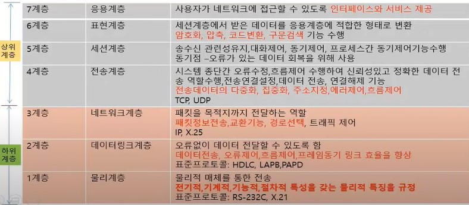
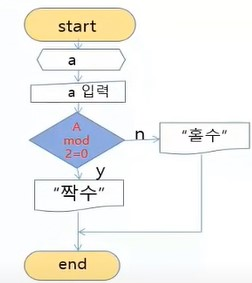

# 정보처리 기능사 실기 정리

## 목차
1. 응용 SW 기초 기술 활용
   
      [- 운영체제](#운영체제)

      [-데이터베이스](#데이터베이스)

      [-네트워크](#네트워크)
2. 프로그래밍 언어 활용
   
   [- C언어](#C언어)

   [- Java](#Java)

3. 애플리케이션 테스트 수행
   
   [- 애플리케이션 테스트 개요](#애플리케이션-테스트-개요)

   [- 애플리케이션 기본 원리](#애플리케이션-기본-원리)

   [- 화이트박스와 블랙박스](#화이트박스와-블랙박스)

   [- 단계별 소프트웨어 검사](#단계별-소프트웨어-검사)

4. SQL 활용
   
   [- SQL 정의](#SQL-정의)

   [- SQL 명령어 분류](#SQL-명령어-분류)

   [- 데이터 정의어](#데이터-정의어)

   [- 데이터베이스](#데이터베이스)

##### 참고강의 : [IB96채널](https://www.youtube.com/watch?v=M-2sfY5Cf3U&t=1396)
***
## 1. 운용 SW 기초 기술 활용
### 운영체제
- 정의 
  - 시스템의 하드웨어 자원과 소프트웨어적 자원을 효과적으로 관리 운영 함으로써 사용자가 시스템을 편리하게 이용 할 수 있도록 한 총체적 소프트웨어
  - 사용자 인터페이스 제공, 데이터 입출력 관리, 파일 관리, 각종 하드웨어 자원관리, 프로그램 제어 수행
- 특징
  - 처리능력 향상
  - 응답시간 단축
  - 사용가능도 증대 
  - 신뢰도 향상
- 발전 과정
  - 일괄
  - 실시간
  - 다중프로그래밍
  - 시분할
  - 다중처리
  - 범용
  - 분산처리
- Windows 10 HOME과 PRO 버전 차이점
  - Windows 10 HOME : 가정에서 일반적으로 사용하기에 최적화 된 제품으로 기본적 프로그램들이 설치되어 있음
  - Windows 10 PRO : 윈도우 10 홈 버전에서 제공하는 모든 기능을 포함하고 여기에 성능 향상과 보안기능 추가
    - BitLocker 장치 암호화 : 시스템 드라이브나 usb 이동 저장 장치에 암호를 설정하는 기능
    - Windows Information Protection : 컴퓨터 작업환경에 변화를 주지 않고 데이터 유출을 막는 기술로 중요한 승인이 안된 프로그램이 데이터에 접근하는것을 차단
- Windows 기본 명령어
   - CLI 기본 명령어 : 명령 프롬포트창에 명령어를 입력하여 작업을 수행

  - Unix 명령어

- 핫스왑 : 전원 ON 상태에서 외부 장치를 안전하게 연결, 제거
- 핫플러그 : 새 장치 연결 할 때 전원 OFF를 해야함
- 아이노드(i-node) : 자료구조(unix) / 정규파일, 디렉터리 파일 등 시스템에 관한 정보 보유
- 가상화 : 단일 호스트에서 다수의 서로 다른 운영체제를 구동 지원하는 기능
- 하이퍼바이저 : 단일호스트에서 다수의 운영체제를 가상으로 구동 지원하는 플랫폼
- 프로세스(Process) : 실행중인 프로그램
- 프로세스 스케줄링 : 자원들의 우선순위 관리
  - 선점형 : 이미 실행중인 프로세스여도 강제로 빼앗아 사용가능 (RR, SRT, 다단계큐, 다단계 피드백큐)
  - 비선점형 : 실행 중 프로세스는 못빼앗음. 순서대로 진행한다.(FIFO, SJF, HRN, 우선순위)


### 데이터베이스
- 정의 및 특징
   - 자료처리(파일처리) 시스템의 문제점인 자료의 종속성과 중복성을 해결하기 위한 소프트웨어 시스템 -> 데이터의 논리적, 물리적 독립성 유지
   - 모든 응용 프로그램들이 데이터베이스를 공용할 수 있도록 관리해준다
   - 데이터베이스와 사용자간의 인터페이스 역할로써 사용자가 요구하는 자료가 타당한지 검사한 후 데이터베이스에서 검색하여 사용자에게 결과를 제공한다
 - 필수 기능
   - 정의 : 데이터베이스에 저장될 데이터의 타입과 구조에 대한 정의와 데이터 이동방식 정의
   - 조작 : 데이터 조작이 가능하도록 하는 기능. 즉, 데이터 삽입, 삭제, 갱신과 조회가 가능하도록 함
   - 제어 : 여러 사용자로부터 데이터 무결성과 보안을 위해 유지하기 위한 기능으로써 권한 검사, 병행 제어 작업 수행
 - 데이터베이스 사용자
   - 데이터베이스 관리자 (DBA)
     - 데이터베이스 시스템의 전체적인 관리 및 운영을 책임지는 사람이나 그룹
     - 데이터의 저장구조와 접근방법 결정
     - 시스템 보안과 무결성을 책임지며 스키마를 정의
     - 시스템 성능과 사용자 요구 및 불편 해소
     - 백업과 회복을 위한 정책 결정 
     - 데이터 사전을 구성하고 유지 관리
   - 일반 사용자
     - 데이터베이스에 존재하는 자원을 업무에 활용하고자 접근하는 사람들
   - 응용프로그래머
     -  일반 호스트 언어로 프로그램을 작성할 때 데이터 조작어를 삽입해서 일반사용자가 응용프로그램을 사용 할 수 있도록 프로그램코딩을 하는 사람들
- 관계 데이터베이스 구조
    - 릴레이션 = 릴레이션 스키마 + 릴레이션 인스턴스
      - 2차원 테이블 형태로 구성
      - 테이블을 릴레이션이라고 한다.
      - 릴레이션의 구조 -> 릴레이션 스키마
      - 릴레이션의 구체적인 값 -> 릴레이션 인스턴스
- 키(KEY) 정의 및 종류
  - 테이블에서 다른 데이터와 구별하기 위한 유일한 값을 가지는 필드 또는 필드의 집합
  - 각각의 튜플을 식별 할 수 있는 유일한 성격을 갖는 것으로 한 테이블에 적어도 한개는 존재해야함.
  - 종류
    - 슈퍼키 : 한 릴레이션 내에 있는 속성들의 집합으로 구성된 키로써 모든 튜플에 대해 유일성(unique)은 만족하지만 최소성(minimality)은 만족하지 않음
    - 후보키 : 한 테이블에서 유일성과 최소성을 만족하는 키
    - 기본키 : 후보키 중에서 선정되어 사용되는 키로 절대 널(Null)이 될 수 없으며 중복 될 수 없다.
    - 외래키 : 릴레이션간의 관계를 나타냄 -> 참조
    - 대체키 : 후보키 중에서 선정된 기본키를 제외한 나머지 후보키
### 네트워크
- IPV6의 개념 및 특징
  - IP주소의 부족 현상을 해결하기 위한 차세대 IP주소 체계
  - IPV4의 주소 공간을 4배 확장한 것으로 128비트 체계의 16진수로 표기하고 4개의 16진수를 콜론(:) 으로 구분
  - IPV4에서는 옵션필드의 구성이 제한적인데 IPV6에서는 확장헤더를 이용해서 IPV4보다 훨씬 다양하고 안정된 옵션을 사용할 수 있음
  - 라우터의 부담을 줄이고 네트워크 부하를 분산시킴
  - 보안, 인증, 라벨링, 데이터 무결성, 데이터 비밀성 제공
  - 특정 흐름의 패킷들을 인식하고 확장된 헤더에 선택사항들을 기술
  - IPV6 종류 : 유니캐스트, 애니캐스트, 멀티캐스트
  - IPV6의 주소형식 
    -> 52AD:31DED:1AFD:59CR:0:0:0:1 또는 52AD:31DED:1AFD:59CR::1
- OSI 7계층
  - 서로 다른 시스템간의 원활한 네트워크를 위해 1977년 ISO에서 제안한 통신 규약
  - 7개의 계층을 두어 시스템의 복잡도를 최소화
  - 인접한 상 하위 계층 간에는 인터페이스를 둔다
  
- 노드(Node) : 단말 접합점, 단말을 이어주는 분기와의 접합점
- 애드훅네트워크 : 자율 구조 네트워크, 노드에 의해 자율적으로 구성된 기반 구조 없는 네트워크
  ## 2. 프로그래밍 언어 활용
  ### C언어
  ```
  #include <stdio.h> // 해더파일 실행
  void main(void) // main 함수 시작
  { // 블록 시작
    printf("Hello\n");
    printf("Hi"); // 프로그램 실행 내용 - 따옴표 안의 내용 출력
  } // 블록의 끝
  ```
  - 짝수 홀수를 구별하는 알고리즘과 코드
  
  
  ```
  #include<stdio.h>
  void main(void)
  {
    int a;
    printf("숫자를 입력하세요");
    scanf("%d", &a);
    if(a % 2 == 0)
      printf("입력하신 %d는 짝수입니다." ,a);
    else
      printf("입력하신 %d는 홀수입니다." ,a);
  }
  ```
- A mod 2 = 0 는 if ( a % 2 == 0 ) 와 같은 의미다.
- 1부터 100까지의 합을 구하는 반복문
```
#include <stdio.h>
void main()
{
  int a, sum = 0;
  for(a = 1; a <= 100; a++) // for 문 반복
    sum += a;
  printf("1부터 100까지의 합: %d\n", sum);

  int a = 1, sum = 0;
  while(a<=100){ // while문 반복
    sum += a;
    a++;
  }
}
```

### Java
- 자바는 객체 지향형 프로그래밍 언어다. 따라서 어떤 자바 프로그램이든 클래스 안에 속성과 메소드를 만들어서 실행한다.
- public static void main (String[] args) -> C의 main과 같은 기능
  
## 3. 애플리케이션 테스트 수행

### 애플리케이션 테스트 개요
- 애플리케이션에 잠재되어 있는 결함을 찾아내는 일련의 행위 또는 절차
- 개발된 소프트웨어가 고객의 요구사항을 만족시키는지 확인
- 소프트웨어가 예상대로 정해진 기능을 정확히 수행하는지 검증
- 테스트 실행 전 소프트웨어의 유형을 분류하고 중점적으로 테스트할 사항을 미리 정리해야함

### 애플리케이션 테스트 기본 원리
- 결함 집중
  - 대다수의 결함들은 개발자나 애플리케이션 특성으로 인하여 특성 모듈에서 집중적으로 발생
- 정황에 의존
  - 소프트웨어 특징, 테스트 환경, 테스터 역량 등 정황에 따라 테스트를 다르게 진행
- 오류
  - 부재의 궤변 - 소프트웨어가 사용자의 요구사항을 만족시키지 못하면 오류가 없더라도 품질이 높다고 할 수 없다.
- 살충제 패러독스
  - 동일한 테스트 케이스로 반복적으로 수행하면 새로운 결함을 찾을 수 없다. 따라서 테스트 케이스를 정기적으로 리뷰하거나 개선할 필요가 있음
- 불완전
  - 모든 가능성을 테스트 하는 것은 불가능
- 결함 발견을 위한 활동
  - 소프트웨어에 결함이 발견되지 않는다 해도 결함이 완전히 없다고 할 수 없다.

### 화이트박스와 블랙박스
- 화이트 박스 테스트
  - 설계된 절차에 초점을 맞춘 테스트로서 프로시저 설계의 제어구조를 사용하여 검사 사례를 설계하며 테스트 과정의 초기에 적용한다.
  - 각 조건에서의 참과 거짓의 모든 논리적 결정이 적어도 한번 이상 수행된다.
  - 프로그램의 제어 구조에 따라 선택, 반복 등의 부분들을 수행함으로써 논리적 경로를 점검한다.
  - 모듈안의 작동을 직접 관찰 할 수 있다.
  - 원시 코드의 모든 문장을 한번 이상 수행함으로써 진행된다.
  - 제품의 내부요소들이 명세서에 따라 수행되고 충분히 실행되는가를 보장하기 위한 검사
  - 프로그램 원시코드의 논리적인 구조를 커버하도록 테스트 케이스를 설계한다.
  - 화이트 박스 종류
    - 기초경로 검사, 제어구조 검사 = 제어흐름 검사(조건 검사, 루프 검사, 데이터 흐름 검사), 분기 테스트
- 블랙 박스 테스트
  - 소프트웨어가 수행할 특정 기능을 알기 위해 각 기능이 완전히 작동 되는것을 입증하는 검사
  - 부정확하거나 누락된 기능, 인터페이스 오류, 자료구조, 외부 데이터베이스 접근에 따른 오류, 행위나 성능의 오류, 초기화와 종료 오류 등을 발견하기 위해 사용 (테스트 후반부에 적용)
  - 데이터 위주 또는 입출력 위주 검사
  - 각 산출물의 기능별로 적절한 정보 영역을 정하여 적합한 입력에 대한 출력의 정확성 점검
  - 블랙 박스 종류
    - 동치(동등) 검사, 경계값 분석, 원인- 효과 그래프 검사, 오류 예측 검사, 비교 검사 등등

### 단계별 소프트웨어 검사
1. 단위 테스트
   - 원시 프로그램 코드에 대한 분석을 진행
   - 코드가 효율적으로 작성 되었는지, 프로젝트 내에 합의된 코딩 표준을 준수하고 있는지 검증
   - 인터페이스, 외부적 입출력, 자료구조, 독립적 기초 경로, 오류처리 경로, 경계 조건 등을 테스트한다.
   - 개발자가 직접 시행
2. 통합 테스트
    - 프로그램을 구성하는 각각의 모듈들을 통합하여 통합된 컴포넌트 간의 인터페이스와 상호작용 상의 오류를 발견하는 작업 수행
    - 개발자가 직접 시행 
3. 시스템 테스트
    - 소프트웨어가 해당 컴퓨터 시스템에서 제대로 수행되는지 테스트하고 다른 시스템 요소들을 전체적으로 테스트 한다.
4. 인수 검사  = 검증 검사 = 확인 테스트
    - 사용자의 요구사항을 만족시키는 가에 중점을 둔 검사 기법
    - 통합 검사 후 전체 내용이 하나의 소프트웨어로 통합 후 요구사항 명세서를 토대로 진행
    - 개발한 소프트웨어를 사용자가 직접 테스트
    - 종류
      - 형상검사 : 소프트웨어 구성요소, 목록, 유지보수를 지원하기 위해 필요한 모든 사항이 제대로 표현 되었는지 검사함.
      - 알파검사 : 제한된 환경에서 사용자가 개발자의 환경에서 프로그램을 실행하는 기법
      - 베타검사 : 제한되지 않은 환경에서 사용자가 프로그램을 실행 한 후 오류가 발생되면 개발자에게 주기적으로 보고하는 형식의 검사 기법
## 4. SQL 활용
### SQL 정의
  - 데이터베이스를 조작하여 원하는 자료를 추출하거나 필요한 데이터를 추가, 삭제, 수정하기 위한 비절차적 프로그래밍 언어
  - 관계형 데이터베이스를 조작하는 프로그래밍 언어
  - 관계 대수와 관계 해석을 기초로 한 혼합 데이터 언어
### SQL 명령어 분류
  - 데이터 정의어 (DDL) : 스키마, 도메인, 테이블, 뷰, 인덱스를 정의하거나 변경/제거 할 때 사용
    - CREATE TABLE 테이블명
      - CREATE VIEW 뷰이름 AS SELECT 컬럼1, 컬림2, ... FROM 테이블 WHERE 조건문
    - ALTER TABLE 테이블명 ADD 컬럼명 데이터 타입
      - ALTER TABLE 테이블명 ADD 컬럼명 데이터타입 : 열추가
      - ALTER TABLE 테이블명 MODIFY 컬럼명 데이터타입 : 타입변경
      - ALTER TABLE 테이블명 DROP 컬럼명 : 열 삭제
    - DROP TABLE 테이블명 [CASCADE / RESTRICT]
      - DROP TABLE 테이블명 RESTRICT : 참조시 삭제 취소
      - DROP TABLE 테이블명 CASCADE : 참조 삭제
  - 데이터 조작어 (DML) : 테이블 내의 레코드를 추가, 제거, 변경, 검색
    - 검색 : SELECT 컬럼명 FROM 테이블명
      - ORDER BY ( ) ASC / DESC
      - GROUP BY ( ) HAVING 조건문
      - INNER JOIN / OUTER JOIN (LEFT/RIGHT/FULL) ON
    - 삽입 : INSERT INTO 테이블명 VALUES 입력값1 ,...
    - 삭제 : DELETE [ FROM ] 테이블명
    - 갱신 : UPDATE 테이블명 SET 컬럼명 = 수정값
  - 데이터 제어어 (DCL) : 데이터베이스 보안, 무결성을 유지하기 위한 언어
    - 권한 부여 : GRANT SELECT ON 테이블명 TO 컬럼명
    - 권한 제거 : REVOKE SELECT ON 테이블명 FROM 컬럼명
    - 완료 : COMMIT
    - 취소 : ROLLBACK
### 데이터 정의어
  - 테이블 정의
  ```
  CREATE TABLE 기본 테이블명 // 생성할 기본 테이블에 속할 속성명 기술
  (속성 기술 ...
    PRIMARY KEY (기본키 속성명)) // 기본키 속성 지정
    UNIQUE (대체키 속성명)
    FOREIGN KEY (외래키 속성명) // 외래키 지정
      REFERENCES 참조 테이블 (기본키 속성명)
      [ON DELECT 옵션]
      [ON UPDATE 옵션]
    [,CONSTRAINT 제약조건명][CHECK(조건식)];

  ```
  - 뷰 정의
    - 뷰 : 하나 이상의 기본 테이블로 부터 유도되는 가상 테이블 SELECT 문의 결과로 뷰 생성
  
 ```
  CREATE VIEW 뷰이름[(속성기술 ...)]
  AS SELECT 명령구문;
 
 ```

### 데이터베이스

- DBA : 데이터베이스 관리자
- DBMS : 데이터베이스 관리 시스템
- 데이터베이스 정규화 : 불필요한 데이터 제거
- 데이터베이스 설계
  - 요구조건 분석
  - 개념적설계
  - 논리적설계
  - 물리적설계
  - 구현
- 스키마 : 데이터베이스 전반적 명세
  - 외부스키마 : 개인관점 / 서브스키마, 필요 부분만 정의
  - 개념스키마 : 조직적관점 / 논리스키마, 제약조건 정의, DBA에 의해 정의
  - 내부스키마 : 시스템프로그래머의 관점
- 트랜잭션 : 하나의 작업 수행을 위한 연산들의 집합
  - ACID : 원자성 / 일관성 / 독립성 / 지속성
- 데이터베이스 이상현상(Anomaly) : 데이터불일치 현상 (삽입이상, 삭제이상, 갱신이상)
- 관계대수 : 정보유도 절차적 언어
- 관계해석 : 정보명시 비절차적 언어